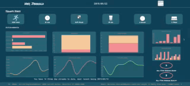

# FitLit Pair Project
## Overview

  For this project, we created a fitness app using TDD  that displays metrics on activity levels, sleep, and hydration. Currently, the application selects a random user from the users datafile on page load.

  On page load, the most recent day of data is automatically displayed. The user can change the date by clicking on the calendar icon in the top right corner.

  The app utilizes responsive design to guarantee proper formatting across mobile and desktop devices.

## Contributors
* [Tyson McNutt](https://github.com/tysnj)
* [Kendall Haworth](https://github.com/kendallha)

## Technologies Used:
* Vanilla JavaScript
* HTML
* CSS
* Mocha & Chai for testing
* NPM package management
* Day.js package
* Chart.js package
* Datepicker.js package

## Deploy Link:
* [Click here to deploy demo](https://tysnj.github.io/fitlit/)

## Install and Setup:
1. Clone this [repository](https://github.com/tysnj/fitlit)
2. Run `npm install`
3. Run `npm test` to perform unit testing
4. Run `open index.html` from the root of the project to run the program

## Demonstration:

* Mobile View
 
* Desktop View
 
* Responsive Design
  

## Learning Goals
* The project spec & rubric can be found [here](https://frontend.turing.io/projects/fitlit.html)
  * Implement ES6 classes that communicate to each other as needed
  * Use object and array prototype methods to perform data manipulation
  * Create a dashboard that is easy to use and displays information in a clear way on multiple screens
  * Write modular, reusable code that follows SRP (Single Responsibility Principle)
  * Implement a robust testing suite using TDD

## Completed Extensions
  * The application calculates and displays how many streaks of 3 or more days of activity the user has, and when the most recent streak ended

## Future Additions
* Login page
  * The user will provide an email address to view their data from the most recent day
* Friends display
  * Visual display showing the user's friends and comparing stats
